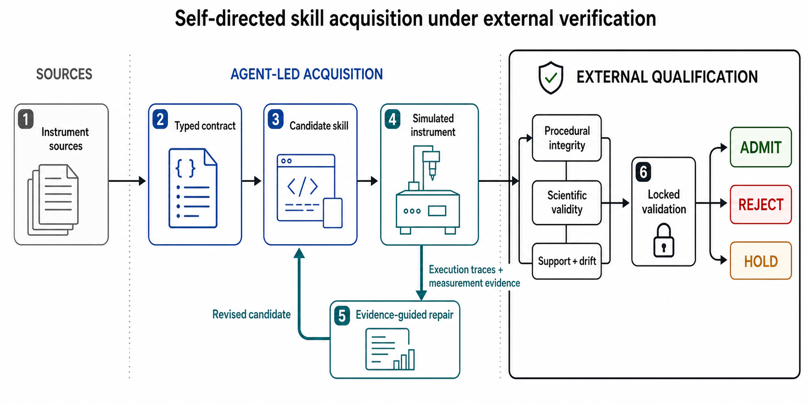

# Proprio

> Point a model at an unfamiliar instrument's sources; have it compile an operating contract
> and draft a runnable skill; let it use simulator feedback to improve that skill; and allow
> Proprio to promote only independently verified candidates.

Proprio is an open-source method for teaching models to operate scientific instruments in
simulation, where they write and repair procedures that pass only after independent execution
and physics checks.




[Watch the evidence-bound OpenFlexure skill-acquisition demo](public/proprio-openflexure-flagship.mp4)

## Method overview

Proprio separates skill development from approval. The model reads instrument documentation,
writes a procedure, runs it in simulation, and repairs failures from the resulting evidence,
while the approval criteria remain outside the model loop.

The agent interface supports any compatible model or provider, while every reported result
remains tied to the model that produced it. Proprio records the requested and resolved model,
provider route, prompt, sampling settings, simulator, verifier, and test evidence for each run.
The method and its generalization studies use no XRD-RL or VOE-Bench data and no trained
judgment checkpoint.

## Current evidence boundary

Under the frozen persistent-context protocol
([method digest `c1a28d1e…7267`](artifacts/evidence/cross-family/method-freeze/manifest.json)),
one binding session per external family produced an independently qualified skill on all three
externally authored simulators — North pipette calibration, HELAO Gamry cyclic voltammetry, and
the CLSLab light spectrometer. Each family reached `ADMIT` with locked qualification `PASS`, a
qualified truthful-feedback repair, a `STAGED` drift-evolution proposal with zero historical
regressions, zero invalid promotions, and transport inside the frozen provider allowlist
([panel summary](cassettes/cross-family/summary.json)). One persistent agent context per
trajectory carries prior actions, tool results, verifier records, and a repair ledger across
cycles ([`src/proprio/agent.py`](src/proprio/agent.py)); promotion authority remains the
deterministic execution, physical-validity, provenance, and locked gates. These families were
screened during method development and are replication cases, not untouched first-exposure
families; the no-feedback comparison arm still receives its own submission outcomes, so the
paired contrast measures registered evidence against outcome-only iteration.

Accumulated paired evidence establishes that simulator feedback changes DSV4's repair success:
across 18 non-overlapping repair units, truthful feedback produced 14 non-regressive repairs and
the same drafts without feedback produced none (exact one-sided paired p = 0.000061). The pooled
analysis spans three protocol generations, so it establishes the broad feedback-repair mechanism,
not a single-protocol rate estimate.

The next frozen-method generalization panel was preregistered across OctoPrint, PyMoDAQ, and
sinstruments before their simulator implementations were inspected. All three failed deterministic
fixture preflight before any model call: the pinned simulators could not execute their complete
registered physical and drift contracts. Proprio returned `HOLD`, spent zero generation calls, and
did not replace a failing family. Cross-family generalization of the frozen v0.2 method therefore
remains **not established**. This is a simulator-suitability failure, not evidence that DSV4 failed
an executable held-out task. See the [preflight summary](artifacts/evidence/heldout-generalization/preflight/summary.json).

| Part | Definition |
| --- | --- |
| Instrument sources | The manual, API or driver documentation, safety limits, and simulator interface shown to the model. |
| Instrument contract | A machine-readable description of permitted actions, observations, limits, valid measurements, reset behavior, working range, and drift. |
| Development loop | The model writes a procedure, runs it on visible simulator conditions, reads the execution and measurement records, and repairs failures. |
| Independent checks | Fixed tests for correct execution, safety limits, measurement validity, repeatability, and previously working behavior. |
| Final test | One frozen procedure run on new simulator conditions that were hidden during development. |
| Method output | The procedure, instrument contract, complete test evidence, and an `approved`, `rejected`, or `hold` decision. |

### Procedure

1. **Discover**
   Give the model the instrument manual, API or driver documentation, safety limits, and a
   simulator.

2. **Compile the contract**
   Write a machine-readable description of the available actions, observations, reset behavior,
   safety limits, valid measurements, working range, and expected drift.

3. **Draft the skill**
   Write a runnable procedure using only permitted instrument actions. Set fixed limits on
   actions, retries, and runtime.

4. **Execute and observe**
   Run the procedure under a range of visible simulator conditions. Record every action,
   instrument response, and measurement.

5. **Diagnose and refine**
   The model reads those records, identifies the likely cause of failure, and revises the
   procedure within a fixed search budget.

6. **Independently qualify**
   Proprio checks that the procedure ran correctly, stayed within its limits, and produced a
   physically valid measurement. A model review may flag problems, but it cannot approve a failed
   measurement.

7. **Lock and validate**
   Freeze the selected procedure and run it once on new simulator conditions that were hidden
   during repair. Give the model no further feedback.

8. **Decide**
   Approve the procedure only if every independent check passes. Reject an invalid procedure.
   Hold the result when there is not enough evidence to decide.

9. **Evolve after drift**
   When the simulated instrument drifts, repeat the repair loop. Keep the revision only if it
   handles the drift without breaking conditions that previously worked.

## What simulation qualification means

Before Proprio approves a skill in simulation, it asks three questions:

1. Did the control procedure execute as intended?
2. Did it produce physically usable evidence?
3. Was it tested inside clearly declared operating conditions?

A skill qualifies only when the procedure reports failures honestly, the measurement meets its
physical criteria, repeated runs agree, and the procedure works on conditions it did not see
during repair.

This result applies to simulation. Use on a physical instrument still requires hardware adapters,
interlocks, recovery tests, reference measurements, supervised trials, and expert sign-off.

## v0.1 Release

DeepSeek V4 Flash was the primary skill-building agent. It read instrument documentation, wrote
runnable procedures, and used simulator feedback to repair failures. Qwen 3.7 Plus served as a
separately prompted reviewer. Proprio's execution and physics checks remained the final authority
in both cases.

| Role | Model and route | Scope |
| --- | --- | --- |
| Skill drafting and repair | DeepSeek V4 Flash (`deepseek/deepseek-v4-flash`, resolved as `deepseek/deepseek-v4-flash-20260423`)  | Primary [70-generation release study](cassettes/replication-dsv4/summary.json) |
| Independent review | Qwen 3.7 Plus (`qwen/qwen3.7-plus`, resolved as `qwen/qwen3.7-plus-20260602`) through Alibaba | [Review calibration and final review panel](cassettes/independent-review/summary.json) |
| Repair-only model check | Qwen 3.7 Plus through Alibaba, starting from eight DeepSeek V4 Flash drafts | [Diagnostic test](cassettes/model-ablations/qwen3.7-plus/shared-original/summary.json) of repair behavior; not a full source-to-skill replication |

The 70 DeepSeek generations used unique study-wide seeds, temperature 0.7, top-p 0.95, the
pinned GMICloud route, and 2,527,902 total tokens.

Qwen cleared the target repair condition in all eight detailed-feedback episodes and none of the
no-feedback episodes, although two of the eight repairs broke behavior that had previously
worked. The diagnostic also used DeepSeek starting drafts, so it did not test Qwen's ability to
draft executable skills or a single-model route across the complete workflow. It should not be
read as a second full acquisition result.

All 60 independently generated procedures passed in the initial six-instrument study, which
covered optical measurements, calibrated liquid delivery, and temperature control. The external
OpenFlexure microscope exposed the limit of that result. All 10 drafts ran, but only 4 of 10
repaired procedures passed the new test conditions. The required rate was at least 8 of 10 for
every instrument. Proprio rejected the other six and did not add an OpenFlexure skill to the
public catalog.

| Result | Observed outcome | Required outcome |
| --- | ---: | ---: |
| Initial code executed | 68/70 (97.1%; Wilson 95% CI 90.2–99.2%) | At least 75% per instrument |
| Initial measurement was physically valid | 61/70 (87.1%) | Reported separately |
| Procedure passed every check | 64/70 (91.4%; Wilson 95% CI 82.5–96.0%) | **FAIL:** at least 80% per instrument; OpenFlexure was 4/10 |
| Invalid procedure approved | 0/6 | Zero |
| Initial six-instrument study | 60/60 | At least 80% per instrument |

## External OpenFlexure test

The external test uses the
[OpenFlexure microscope server](https://gitlab.com/openflexure/openflexure-microscope-server)
at revision `d26b93e1be1093e9d696b634dd1f7dde3bb7142a`. OpenFlexure runs as a separate GPL-3.0
process through its public LabThings/FastAPI interface; Proprio redistributes none of its source.
The model received only the instrument documentation and public controller contract.

The verifier does not read the simulator's own focus score. It checks public stage position,
frame integrity, calibrated focus position, high-frequency image energy, and a separate Laplacian
focus calculation. Both image checks must pass.

| Verifier result | Value |
| --- | ---: |
| Labeled cases | 2,700 |
| Invalid conditions | 8 classes |
| Invalid measurements accepted | 0 |
| Valid measurements rejected | 1/300 (0.33%) |
| Agreement between the two image checks on valid cases | 99.67% |
| Overall agreement with labeled truth | 90.59% |

The two image checks share the same exported frame, so they are not statistically independent.
They use different calculations, neither reads hidden simulator state, and public stage position
provides a third calibrated reference. This remaining correlation is reported directly. See the
[metrology record](artifacts/evidence/microscopy/locked/metrology/summary.json) and
[manual frame inspection](artifacts/evidence/microscopy/locked/manual-inspection.md).

The failed 4/10 result exposed two problems that a single demonstration would have missed:

- four agents reached the turn limit without submitting a final candidate;
- two candidates passed the visible repair case but failed new starting positions hidden during
  repair.

## Independent model review

Qwen 3.7 Plus read the documentation, original and revised skills, code difference, complete
execution record, and fresh simulator replay. It could reject or hold a candidate, but it could
not override a failed deterministic check.

The reviewer passed all 56 calibration cases and all 42 cases from the initial six-instrument
study. It matched 47 of 49 labels that had been fixed in advance for the complete study. In the
two disagreements, fresh execution evidence showed that the expected labels were wrong, and the
reviewer correctly rejected the candidates. The reviewer result therefore remains **FAIL**, with
zero overrides of failed execution or measurement checks. See the
[study summary](cassettes/independent-review/summary.json) and
[manual inspection](cassettes/independent-review/manual-inspection.md).

## X-ray diffraction reference implementation

Powder X-ray diffraction is the reference instrument because operation quality and evidence
quality are tightly connected. The hardware-free implementation uses Bluesky RunEngine and
`ophyd.sim` for execution, an analytic NumPy model for Cu Kα LaB6 detector frames, and pyFAI plus
independent telemetry and statistical checks for verification. The frame generator and verifier
are intentionally different implementations.

XRD remains a reference instrument, not generalization data.

The test battery covers geometry errors, zero shift, sample displacement, detector saturation,
dead-time distortion, weak counting statistics, integration failure, unindexed peaks, and an
implausible lower tail of reduced chi-squared. Crystal-fit checks are used only on calibrant or
quality-control scans. Unknown samples are checked for acquisition and preprocessing integrity,
not for whether a scientific interpretation is correct.

| XRD check | Result |
| --- | --- |
| Execution fault injection | 5/5 classes detected; dropped frame labeled `degraded` |
| Valid calibrant controls | 0/300 false rejections |
| Invalid calibrant measurements | 0 observed false acceptances in 300 cases for each of 9 classes |
| Always-valid adversary | 2,700/2,700 invalid cases rejected |
| Declared-condition test | 100% detection; 0% false alarms |
| Complete operation record | Valid path passed; successful execution with a saturated frame failed validity |

The sample-displacement check missed the exact fault label in 19 of 300 injected cases, although
other shift or indexing checks still rejected every affected measurement. The approval decision
was correct; the weaker fault attribution remains visible.

## Reproduce the hardware-free evidence

Requirements: Python 3.12 or 3.13 and [uv](https://docs.astral.sh/uv/).

```bash
git clone https://github.com/Dynamical-Systems-Research/proprio.git
cd proprio
uv sync --locked --extra dev

uv run proprio composition-battery \
  --output-dir artifacts/generated/composition

uv run proprio confirmatory-study-replay \
  --cassette-dir cassettes/confirmatory-dsv4 \
  --output-dir artifacts/generated/confirmatory-replay

uv run proprio replication-study-summary \
  --cassette-dir cassettes/replication-dsv4
```

Run XRD and cross-instrument measurement tests with:

```bash
uv run proprio metrology \
  --cases-per-class 300 \
  --output-dir artifacts/generated/metrology

uv run proprio confirmatory-metrology \
  --cases-per-class 300 \
  --output-dir artifacts/generated/confirmatory-metrology

uv run proprio microscopy-metrology \
  --reference-dir artifacts/evidence/microscopy/locked/reference \
  --output-dir artifacts/generated/microscopy-metrology \
  --cases-per-class 300
```

Fresh model generation is a separate release test:

```bash
OPENAI_API_KEY="$OPENROUTER_API_KEY" \
OPENAI_BASE_URL=https://openrouter.ai/api/v1 \
MODEL=deepseek/deepseek-v4-flash \
OPENROUTER_PROVIDER=GMICloud \
DSV4_REASONING_EFFORT=high \
  uv run proprio replication-study-live \
    --output-dir artifacts/live/replication
```

## Add an instrument

1. Start from [`skills/xrd-reference/SKILL.md`](skills/xrd-reference/SKILL.md) and the examples
   under [`skills/simulated/`](skills/simulated/).
2. Connect the public instrument API or driver and provide a simulator with explicit reset and
   failure behavior.
3. Define honest `succeeded`, `failed`, `degraded`, and `unavailable` outcomes.
4. Write independent checks for the measurements the instrument should produce. Document any
   assumptions shared with the simulator.
5. Build labeled valid and invalid tests before asking a model to generate a skill. Fix the
   thresholds, prompts, model-provider settings, working range, and hidden test cases in advance.
6. Use [`schemas/skill.schema.json`](schemas/skill.schema.json), retain raw source and execution
   records, and replay previously working conditions before approving an evolved skill.
7. Keep scientific decisions—such as phase assignment or experimental choice—out of the
   instrument-operation record.

The optional MatteriX adapter remains honestly `unavailable`; see
[`docs/matterix-adapter.md`](docs/matterix-adapter.md). GSAS-II and xrayutilities remain behind
external adapters that preserve their upstream licenses.

## Instrument-specific verification work

Independent physical verification requires instrument-specific engineering. Proprio reports
nonblank source lines, declared checks, labeled failure classes, and external dependencies. It
does not estimate person-hours from Git history.

| Instrument family | Simulator or adapter LOC | Verifier LOC | Documentation LOC | Physical checks | Invalid classes |
| --- | ---: | ---: | ---: | ---: | ---: |
| Optical measurement (2 instruments) | 130 | 107 | 30 | 7 each | 4 |
| Calibrated delivery (2 instruments) | 113 | 80 | 24 | 5 / 6 | 4 |
| Thermal control (2 instruments) | 100 | 50 | 24 | 7 each | 4 |
| OpenFlexure microscopy | 333 | 162 | 32 | 10 | 8 |

The OpenFlexure integration also required a 185-line measurement-test harness. Person-hours are
not reported because prospective labor logging was not active. See the
[burden manifest](artifacts/evidence/engineering-burden/summary.json).

## Scope and limitations

Proprio v0.1 is a simulation-only qualification method. It does not establish safe autonomous
operation on physical hardware. Deployment still requires hardware adapters, interlock and
recovery tests, reference measurements on the target instrument, uncertainty and drift studies,
supervised trials, and instrument-expert approval.

The initial six-instrument study shows repeatable acquisition and repair within three simulator
families; it is not universal generalization. The external OpenFlexure result is deliberately
reported as a failed breadth test. Simulator and verifier independence remains imperfect, model
generation is stochastic, and each physical contract requires specialist work. These are the
current research boundaries.

See the [technical note](docs/technical-note.md), [research protocol](docs/research-agenda.md),
[protocol amendments](docs/protocol-amendments.md), and
[release status](docs/release-status.md). Released skills are hash-bound in
[`catalog.json`](catalog.json), and released evidence is listed in
[`artifacts/evidence/manifest.json`](artifacts/evidence/manifest.json).

## Repository map

| Path | Contents |
| --- | --- |
| [`src/proprio/`](src/proprio/) | simulators, verifiers, agent loop, replay, and CLI |
| [`skills/`](skills/) | XRD reference, Keithley development case, and qualified skills |
| [`sources/`](sources/) | instrument documentation shown to the model |
| [`cassettes/`](cassettes/) | raw model messages, tool calls, reviews, and deterministic results |
| [`artifacts/evidence/`](artifacts/evidence/) | measurement tests, raw samples, standardized records, and manifest |
| [`artifacts/invalidated/`](artifacts/invalidated/) | excluded runs retained for audit |
| [`docs/`](docs/) | technical note, protocol, amendments, release status, and figure assets |

Proprio is licensed under Apache-2.0. External simulators retain their upstream licenses. See
[`CONTRIBUTING.md`](CONTRIBUTING.md) and [`CITATION.cff`](CITATION.cff).
