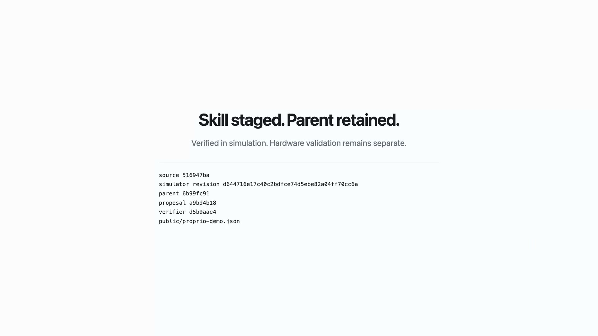

# Proprio: Simulator-Verified Skill Acquisition for Scientific Instruments

[](https://github.com/Dynamical-Systems-Research/proprio/actions/workflows/ci.yml)

Point an agent at an instrument's documentation. Proprio gives it a persistent simulator loop for
drafting an operating skill, executing it, inspecting the evidence, and repairing what failed.
Independent execution and physical checks decide what enters the skill library.

Verified in simulation. Hardware validation remains separate.

[Technical report](https://dynamicalsystems.ai/blog/simulator-verified-skill-acquisition) ·
[Skill catalog](catalog.json) ·
[Published skills](skills) ·
[OpenFlexure full-loop demo](https://dynamicalsystems.ai/blog/simulator-verified-skill-acquisition#demo) ·
[Video evidence manifest](public/proprio-demo.json)

[](https://dynamicalsystems.ai/blog/simulator-verified-skill-acquisition#demo)

The demo shows a persistent GPT-5.6 Luna agent reading the development source in a live terminal while
the native OpenFlexure microscope simulator runs beside it. A fresh execution is rejected on its
acquisition-time budget, the agent repairs the skill to an admitted parent, a registered drift breaks
it, a first evolution proposal is rejected, and a corrected proposal is staged. The published
OpenFlexure package retains the exact admitted parent and a current staged proposal that reruns the
same provider-backed evolution gate. Its compact verification record binds the current proposal;
the historical [evidence manifest](public/proprio-demo.json) separately binds the recorded agent
session, original proposal, fresh simulator executions, verifier records, and media identity.

## Published skills

The public interface is the flat [`skills/`](skills) directory. Every package is independently
installable and contains `SKILL.md`, an `agents/openai.yaml` discovery manifest, exact bounded code
where required, focused controller references, and a compact verification record. The historical
raw model conversations are not required to install, use, reproduce, or extend these packages.

[`catalog.json`](catalog.json) content-addresses all 12 packages. `simulation_qualified` means the
exact code passed visible and independently held simulator checks. `simulation_staged` means the
proposal passed its recorded evolution gate but has not received the broader qualification claim.
Every package still requires separate validation on real hardware.

| Instrument | Skill | Status |
| --- | --- | --- |
| 2D area-detector powder XRD | [Operate and observe](skills/xrd-operate-observe/SKILL.md) | `simulation_qualified` |
| Keithley 2450-style SMU | [Measure current](skills/keithley-2450-measure-current/SKILL.md) | `simulation_qualified` |
| Absorbance plate reader | [Read absorbance plate](skills/absorbance-plate-read/SKILL.md) | `simulation_qualified` |
| Calibrated peristaltic pump | [Dose 10 mL](skills/calibrated-pump-dose/SKILL.md) | `simulation_qualified` |
| Dual-channel pump array | [Blend two pumps](skills/dual-pump-blend/SKILL.md) | `simulation_qualified` |
| Fluorescence plate reader | [Read fluorescence plate](skills/fluorescence-plate-read/SKILL.md) | `simulation_qualified` |
| Temperature controller | [Run isothermal hold](skills/isothermal-hold/SKILL.md) | `simulation_qualified` |
| Thermal controller | [Run thermal cycle](skills/thermal-cycle/SKILL.md) | `simulation_qualified` |
| North Cytation | [Calibrate pipette](skills/north-pipette-calibration/SKILL.md) | `simulation_qualified` |
| HELAO Gamry | [Run cyclic voltammetry](skills/helao-gamry-cv/SKILL.md) | `simulation_qualified` |
| CLSLab | [Measure light spectrum](skills/clslab-light-spectrometer/SKILL.md) | `simulation_qualified` |
| OpenFlexure microscope | [Run adaptive autofocus](skills/openflexure-adaptive-autofocus/SKILL.md) | `simulation_staged` |

### Install the skill library

The [`skills` installer](https://github.com/vercel-labs/skills) discovers the 12 packages directly
from this repository. List them before installing:

```bash
npx skills add Dynamical-Systems-Research/proprio --list
```

Install the complete library into a specific agent project:

```bash
# Codex -> .agents/skills/
npx skills add Dynamical-Systems-Research/proprio --skill '*' --agent codex -y

# Claude Code -> .claude/skills/
npx skills add Dynamical-Systems-Research/proprio --skill '*' --agent claude-code -y

# Cursor, OpenCode, or Gemini CLI
npx skills add Dynamical-Systems-Research/proprio --skill '*' --agent cursor -y
npx skills add Dynamical-Systems-Research/proprio --skill '*' --agent opencode -y
npx skills add Dynamical-Systems-Research/proprio --skill '*' --agent gemini-cli -y
```

Add `--global` to install into the selected agent's user-level skill directory. To install only one
package, replace `--skill '*'` with a name such as
`--skill openflexure-adaptive-autofocus`. Installing a skill does not install the Proprio runtime;
the package supplies the procedure, controller contract, verification record, and qualification
boundary an agent needs.

## Quickstart

This takes one instrument source through drafting, visible simulator execution, evidence-guided
repair, and locked verification. You finish with a complete verification record and an ADMIT, REJECT,
or HOLD decision.

### 1. Install

```bash
git clone https://github.com/Dynamical-Systems-Research/proprio.git
cd proprio
uv sync --locked --extra dev --extra simulators
```

### 2. Install the example simulator

The adapter expects the pinned checkout under `/tmp/proprio-candidates`.

```bash
mkdir -p /tmp/proprio-candidates
git clone --filter=blob:none --no-checkout \
  https://github.com/AccelerationConsortium/North-Cytation \
  /tmp/proprio-candidates/North-Cytation
git -C /tmp/proprio-candidates/North-Cytation sparse-checkout set \
  sdl_pipette_calibration/protocols
git -C /tmp/proprio-candidates/North-Cytation checkout \
  3f49b5faba803a4a5d22544aa2ea5923ec513e20
```

### 3. Give the source to your agent

Any agent that can edit files and run commands can use Proprio. Inspect the source bundle, then ask
the agent to draft a skill from it alone.

```bash
mkdir -p runs/candidate
uv run proprio inspect-source \
  --instrument proprio.external_reference.north-pipette-calibration > runs/source.json
```

> Read `runs/source.json`. Using only that source and its controller contract, create
> `runs/candidate/SKILL.md` and `runs/candidate/skill.py`. The Python entry point must be
> `run(controller)`. Do not inspect existing skills, verifier code, evidence, or locked conditions.

### 4. Execute, inspect, and repair

```bash
uv run proprio execute-candidate \
  --instrument proprio.external_reference.north-pipette-calibration \
  --candidate-dir runs/candidate \
  --output-dir runs/attempt-001
uv run proprio read-visible-evidence \
  --run-dir runs/attempt-001 > runs/attempt-001/evidence.json
```

If the decision is REJECT or HOLD, keep the same agent context and ask it to diagnose the failed
checks from `runs/attempt-001/evidence.json` and update only the candidate. Every attempt is
immutable; increment the attempt number for further repairs.

### 5. Run locked verification

Once a visible attempt returns ADMIT, run the independently held conditions. The agent does not see
these during drafting or repair.

```bash
uv run proprio verify-locked \
  --instrument proprio.external_reference.north-pipette-calibration \
  --candidate-dir runs/candidate \
  --output-dir runs/locked
```

ADMIT means the candidate passed the registered simulation checks. Real hardware still requires
site-specific validation.

## Stage a skill evolution

After simulated deployment drift, stage a proposal only if it passes the changed condition and
replays the behavior that admitted its parent.

```bash
uv run proprio stage-evolution \
  --instrument proprio.external_reference.north-pipette-calibration \
  --parent-dir runs/admitted \
  --candidate-dir runs/proposal \
  --output-dir runs/evolution
```

These operations are also importable from [`proprio.interface`](src/proprio/interface.py) as
`inspect_source`, `execute_candidate`, `read_visible_evidence`, `verify_locked`, and
`stage_evolution`. The agent owns its context; Proprio owns execution records and promotion.

## Add an instrument provider

Install a Python package that publishes a versioned `proprio.instrument_providers` entry point.
Its namespaced instruments become available to the same commands above without editing Proprio.
The provider supplies documentation, a bounded controller adapter, simulator, conditions, and an
independent verifier; Proprio retains execution records and admission authority. See
[`docs/instrument-providers.md`](docs/instrument-providers.md) for the small contract and package
example. Installing a provider does not publish or admit a skill, and simulation does not qualify
hardware.

## Verification suites

XRD's executable skill uses the same provider-backed inspection, visible execution, and locked
verification interface as the rest of the library. Its independent raw-frame verifier is backed by
the preregistered metrology suite below. The Keithley suite remains the compact admission proof:
circuit-law checks admit the correct skill and reject a plausible wrong-range procedure the model
accepted.

```bash
uv run proprio metrology --cases-per-class 300 --output-dir runs/metrology
uv run proprio composition-battery --output-dir runs/xrd-composition
uv run proprio skill-admission --output-dir runs/skill-admission
```

## Repository map

- [`skills`](skills) is the installable public library: instructions, controller references, exact
  operating code, and compact verification records.
- [`src/proprio`](src/proprio) is the reusable method implementation: bounded execution,
  reduced-order simulators, independent verifiers, acquisition, replay, and evolution gates.
- [`docs/instrument-providers.md`](docs/instrument-providers.md) is the extension contract for
  separately installable instrument/simulator packages.
- [`catalog.json`](catalog.json) is the content-addressed publication manifest.
- [`sources`](sources), [`tests`](tests), and focused verification artifacts reproduce and extend
  the qualification method. Run transcripts and experimental logs are generated locally under
  `runs/`; they are not part of the release.

Regenerate the compact package records and catalog without publishing raw traces:

```bash
uv run proprio publish-skills --root .
```

Publication reruns source inspection, visible execution, evidence readback, and locked verification
for every simulation-backed skill. Staged skills also rerun parent qualification and evolution.
It fails without writing if any provider is unavailable; the pinned native OpenFlexure setup is in
[`docs/instrument-providers.md`](docs/instrument-providers.md#reproduce-the-openflexure-provider).
Because that native replay performs 41 simulator executions, it is an explicit manual/release gate
in [OpenFlexure release validation](.github/workflows/openflexure-release.yml), not standard CI.

## License and citation

Proprio is released under the [Apache License 2.0](LICENSE). Citation metadata is in
[`CITATION.cff`](CITATION.cff), and contribution requirements are in [`CONTRIBUTING.md`](CONTRIBUTING.md).
