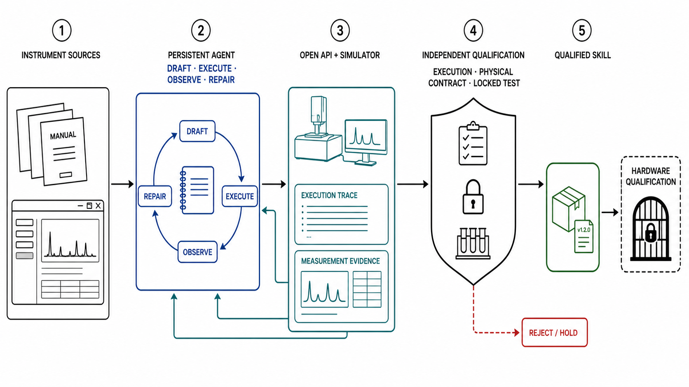

# Proprio: Simulator-Verified Skill Acquisition for Scientific Instruments

Point your agent at an instrument's documentation. Proprio gives it a persistent simulator loop
for drafting an operating skill, executing it, inspecting the evidence, and repairing what failed.
Independent execution and physical checks decide what enters the skill library.

Proprio verifies skills in simulation before deployment. Real instruments still require
site-specific hardware validation.

[Technical report](docs/technical-report.md) ·
[Skill catalog](catalog.json) ·
[OpenFlexure demo](public/proprio-openflexure-flagship.mp4)



## Overview

Every instrument skill begins with the sources an operator would read, including manuals, driver
documentation, API references, and operating limits. The agent turns those sources into bounded
control code and keeps one context across execution, diagnosis, and repair. Failed checks return as
evidence in that same context, so later attempts retain the model's actions, observations, and
prior diagnoses.

```text
documentation and operating limits
      ↓
persistent agent context
      ↓
draft → execute → inspect evidence → repair
      ↓
independent execution and physical verification
      ↓
held-out replay → ADMIT / REJECT / HOLD
      ↓
simulated drift → verified evolution proposal
```

The agent proposes each revision. It cannot change the verifier, held-out conditions, thresholds,
or admission decision. A failed or incomplete record resolves to `REJECT` or `HOLD`. After simulated
drift, a proposed revision must pass the changed condition, replay the conditions that supported its
parent, and pass a fresh held-out sweep before it can be staged.

The experiments test each part of this loop.

- Verified simulator feedback produced 14 non-regressive repairs from 18 paired starting drafts.
  Blind retrying produced none.
- Six confirmatory instruments passed verification in 60 of 60 independent generations.
- One frozen persistent protocol completed acquisition, repair, held-out verification, drift
  detection, and staged evolution across North, HELAO, and CLSLab, with zero invalid promotions.

The external panel contains one binding session per screened simulator family. It establishes
replication across those tested interfaces, not a population-level success rate or untouched
first exposure. The [technical report](docs/technical-report.md) connects every result to its
evidence record. The frozen method is defined in
[`method.yaml`](src/proprio/data/method.yaml).

## Published skills

Every published package contains a `SKILL.md`, bounded control code where required, provenance
hashes, and a link to the record that admitted it.

| Instrument | Skill | Verification record |
| --- | --- | --- |
| 2D powder XRD | [XRD reference](skills/xrd-reference/SKILL.md) | [Composition record](artifacts/evidence/composition/summary.json) |
| Keithley 2450-style SMU | [Current measurement](skills/keithley-2450/SKILL.md) | [Admission record](artifacts/evidence/skill-admission/summary.json) |
| North Cytation | [Pipette calibration](skills/external/north-pipette-calibration/SKILL.md) | [Session record](cassettes/cross-family/north-pipette-calibration/session-000/summary.json) |
| HELAO Gamry | [Cyclic voltammetry](skills/external/helao-gamry-cv/SKILL.md) | [Session record](cassettes/cross-family/helao-gamry-cv/session-000/summary.json) |
| CLSLab | [Light spectroscopy](skills/external/clslab-light-spectrometer/SKILL.md) | [Session record](cassettes/cross-family/clslab-light-spectrometer/session-000/summary.json) |

[`catalog.json`](catalog.json) binds each skill, source bundle, control implementation, verifier,
and admission record by hash.

## Run Proprio

```bash
git clone https://github.com/Dynamical-Systems-Research/proprio.git
cd proprio
uv sync --locked --extra dev --extra simulators
```

<details>
<summary>Install the pinned external simulators</summary>

The cross-family adapters expect these checkouts under `/tmp/proprio-candidates`.

```bash
mkdir -p /tmp/proprio-candidates

git clone --filter=blob:none --no-checkout \
  https://github.com/AccelerationConsortium/North-Cytation \
  /tmp/proprio-candidates/North-Cytation
git -C /tmp/proprio-candidates/North-Cytation sparse-checkout set \
  sdl_pipette_calibration/protocols
git -C /tmp/proprio-candidates/North-Cytation checkout \
  3f49b5faba803a4a5d22544aa2ea5923ec513e20

git clone --filter=blob:none --no-checkout \
  https://github.com/helgestein/helao-pub \
  /tmp/proprio-candidates/helao-pub
git -C /tmp/proprio-candidates/helao-pub sparse-checkout set driver
git -C /tmp/proprio-candidates/helao-pub checkout \
  d644716e17c40c2bdfce74d5ebe82a04ff70cc6a

git clone --filter=blob:none --no-checkout \
  https://github.com/sparks-baird/self-driving-lab-demo \
  /tmp/proprio-candidates/self-driving-lab-demo
git -C /tmp/proprio-candidates/self-driving-lab-demo sparse-checkout set src
git -C /tmp/proprio-candidates/self-driving-lab-demo checkout \
  34e4e8cd880bc7b788109d8a56da3f6fae978518
```

</details>

Any agent that can edit files and run commands can use Proprio. Start by reading the source bundle.

```bash
uv run proprio inspect-source \
  --instrument north-pipette-calibration > runs/source.json
```

Have the agent write `SKILL.md` and `skill.py` under `runs/candidate`, then execute it and return
the visible simulator evidence to the same agent context.

```bash
uv run proprio execute-candidate \
  --instrument north-pipette-calibration \
  --candidate-dir runs/candidate \
  --output-dir runs/visible \
  --agent codex

uv run proprio read-visible-evidence --run-dir runs/visible
```

The agent may repair and rerun the candidate from that evidence. Locked replay remains a separate
gate.

```bash
uv run proprio verify-locked \
  --instrument north-pipette-calibration \
  --candidate-dir runs/candidate \
  --output-dir runs/locked \
  --agent codex
```

After simulated deployment drift, a proposal can be staged only if it also replays the behavior
that admitted its parent.

```bash
uv run proprio stage-evolution \
  --instrument north-pipette-calibration \
  --parent-dir runs/admitted \
  --candidate-dir runs/proposal \
  --output-dir runs/evolution \
  --agent codex
```

These operations are also importable from [`proprio.interface`](src/proprio/interface.py) as
`inspect_source`, `execute_candidate`, `read_visible_evidence`, `verify_locked`, and
`stage_evolution`. The agent owns its context; Proprio owns execution records and promotion.

<details>
<summary>Reproduce the published DSV4 panel</summary>

```bash
export OPENAI_API_KEY="$OPENROUTER_API_KEY"
export OPENAI_BASE_URL=https://openrouter.ai/api/v1
export MODEL=deepseek/deepseek-v4-flash
export OPENROUTER_PROVIDER=DeepInfra,GMICloud
export MODEL_REASONING_EFFORT=high

uv run proprio cross-family-freeze --output-dir runs/method-freeze
uv run proprio cross-family-panel \
  --freeze runs/method-freeze/manifest.json \
  --output-dir runs/cross-family
```

The raw messages, tool results, simulator records, repair ledgers, and decisions are written to the
output directory. Checked-in cassettes keep CI deterministic.

</details>

## Reference verification

XRD is the reference instrument. It uses Bluesky and Ophyd for execution, an independent synthetic
LaB6/Si generator and verifier for measurement validity, and a typed support check before evidence
reaches a policy. It does not use XRD-RL or VOE-Bench data.

```bash
uv run proprio procedural-battery --output-dir runs/procedural
uv run proprio metrology --cases-per-class 300 --output-dir runs/metrology
uv run proprio support-battery --output-dir runs/support
uv run proprio composition-battery --output-dir runs/xrd-reference
```

The Keithley example is the compact admission proof. Circuit-law checks admit the correct skill and
reject a plausible wrong-range procedure that the model accepted.

```bash
uv run proprio skill-admission \
  --cassette-dir cassettes/skill-admission \
  --output-dir runs/skill-admission
```

## Repository map

- [`src/proprio`](src/proprio) contains the persistent agent, bounded runtime, adapters, and gates.
- [`sources/instruments`](sources/instruments) contains the documentation shown to the model.
- [`skills`](skills) contains the published skill packages.
- [`cassettes`](cassettes) contains raw model and execution records.
- [`artifacts/evidence`](artifacts/evidence) contains metrology and verification evidence.
- [`catalog.json`](catalog.json) is the content-addressed skill catalog.

The [OpenFlexure demo](public/proprio-openflexure-flagship.mp4) shows the documentation-to-simulator
repair loop used during method development.

## License and citation

Proprio is released under the [Apache License 2.0](LICENSE). Citation metadata is in
[`CITATION.cff`](CITATION.cff), and contribution requirements are in
[`CONTRIBUTING.md`](CONTRIBUTING.md).
